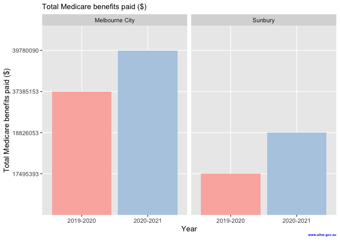

**Research Question:**

Since COVID-19 pandemic made people aware to their health because COVID-19 could quickly spade to other and had the critical symptom in 2019, moreover, it could mutate to the new COVID virus. Although there is no COVID-19 in the world, Melbourne is going to be aging society (Australian Institute of Health and Welfare, 2021). It makes medical services, such as GP attendances and Specialist attendances, are important in Melbourne. However, every medical service is not free because they have high cost to pay in facilities, tools, and wages for medical staffs. Moreover, they have high risk of prosecution due to treatment errors. They are often prosecuted by their patients and their relatives. This is a part of reason why the medical business wants to get profits. 

Furthermore, the data from Australian Institute of Health and Welfare (AIHW) is interesting for Medicare benefits per 100 people, why Melbourne City has the lowest value, while Sunbury, where is less population, has the highest value.

Therefore, if the businesses want to expand a new clinic and get the highest profit.  **Where is the best area for expanding a new clinic between Melbourne City and Sunbury based on Medicare benefits from 2019 to 2021?**

(\#fig:benefit100)Medicare benefits per 100 people ($)

(\#fig:benefit)Total Medicare benefits paid ($)

<table class=" lightable-material" style='font-family: "Source Sans Pro", helvetica, sans-serif; width: auto !important; margin-left: auto; margin-right: auto;'>
<caption>(\#tab:patients)Number of patients</caption>
 <thead>
  <tr>
   <th style="text-align:left;"> Year </th>
   <th style="text-align:left;"> Name </th>
   <th style="text-align:left;"> GP_attendances </th>
   <th style="text-align:left;"> Specialist_attendances </th>
  </tr>
 </thead>
<tbody>
  <tr>
   <td style="text-align:left;"> 2019-20 </td>
   <td style="text-align:left;"> Melbourne City </td>
   <td style="text-align:left;"> 93293 </td>
   <td style="text-align:left;"> 31486 </td>
  </tr>
  <tr>
   <td style="text-align:left;"> 2020-21 </td>
   <td style="text-align:left;"> Melbourne City </td>
   <td style="text-align:left;"> 89432 </td>
   <td style="text-align:left;"> 32305 </td>
  </tr>
  <tr>
   <td style="text-align:left;"> 2019-20 </td>
   <td style="text-align:left;"> Sunbury </td>
   <td style="text-align:left;"> 40814 </td>
   <td style="text-align:left;"> 15083 </td>
  </tr>
  <tr>
   <td style="text-align:left;"> 2020-21 </td>
   <td style="text-align:left;"> Sunbury </td>
   <td style="text-align:left;"> 40209 </td>
   <td style="text-align:left;"> 15609 </td>
  </tr>
</tbody>
</table>

<table class=" lightable-material" style='font-family: "Source Sans Pro", helvetica, sans-serif; width: auto !important; margin-left: auto; margin-right: auto;'>
<caption>(\#tab:fee)Total provider fees ($)</caption>
 <thead>
  <tr>
   <th style="text-align:left;"> Year </th>
   <th style="text-align:left;"> Name </th>
   <th style="text-align:left;"> GP_attendances </th>
   <th style="text-align:left;"> Specialist_attendances </th>
  </tr>
 </thead>
<tbody>
  <tr>
   <td style="text-align:left;"> 2019-20 </td>
   <td style="text-align:left;"> Melbourne City </td>
   <td style="text-align:left;"> 42596617 </td>
   <td style="text-align:left;"> 16064234 </td>
  </tr>
  <tr>
   <td style="text-align:left;"> 2020-21 </td>
   <td style="text-align:left;"> Melbourne City </td>
   <td style="text-align:left;"> 44490425 </td>
   <td style="text-align:left;"> 17855074 </td>
  </tr>
  <tr>
   <td style="text-align:left;"> 2019-20 </td>
   <td style="text-align:left;"> Sunbury </td>
   <td style="text-align:left;"> 18427958 </td>
   <td style="text-align:left;"> 6260020 </td>
  </tr>
  <tr>
   <td style="text-align:left;"> 2020-21 </td>
   <td style="text-align:left;"> Sunbury </td>
   <td style="text-align:left;"> 19602176 </td>
   <td style="text-align:left;"> 6893232 </td>
  </tr>
</tbody>
</table>

Figure \@ref(fig:benefit100) illustrates the Medicare benefits per 100 people of Sunbury more than Melbourne city since 2019 until 2021 on the other hand figure \@ref(fig:benefit) shows Total Medicare benefit paid of Melbourne city more than Sunbury around 66.66 % and 50 % in 2019 and 2020, respectively. Moreover, both figures show the conflict of result that means both of variables have different measures. In the investigation of this report, it was found that the measures are not same by Total Medicare benefits paid is measured by the end of year (December) while Medicare benefits per 100 people is used by the end of previous financial year (June). Furthermore, the decreasing of number of patients in both of area in table \@ref(tab:patients) can refer to migration backed to their countries because of COVID-19 pandemic. Moreover, table \@ref(tab:fee) illustrates the increasing of total provider fee in both of general practitioner (GP) attendances and specialist attendance. The reason for the increasing may be due to the side effects of COVID-19 pandemic such as psychological distress for adults aged 18–45 and decreased services at the start of pandemic and followed by slightly above the previous year (Australian Institute of Health and Welfare, 2021).

**Conclusion:**

From the results, Medicare benefits per 100 people is different way with Total Medicare benefits paid because it is measured by the end of previous financial year (June), while the Total Medicare benefits paid, number of patient, and total provider fee are measured by the end of year (December). So, Medicare benefits per 100 people is not an effective measure in total benefits of the year, but it is effective in the end of financial year analysis.

Therefore, if businesses that want to expand a new clinic and focus on the total benefit of the end of financial year, they should invest a new clinic at Sunberry. On the contrary, if the businesses focus on the total benefit of the year, they should invest a new clinic at Melbourne city. However, the investment of a new clinic cannot analyze only the benefits, business should research in area, community, and competitors.
 

**Source :**

Australian Institute of Health and Welfare. (2021). *CSV file: Medicare-subsidised GP, allied health and specialist health care across local areas health care: 2019-20 to 2020–21*. from
https://www.aihw.gov.au/reports-data/health-welfare-overview/health-welfare-expenditure/data?page=1

Australian Institute of Health and Welfare. (2021, Nov 30). *Older Australians*. AIHW.
https://www.aihw.gov.au/reports/older-people/older-australia-at-a-glance/contents/summary

Australian Institute of Health and Welfare. (2021, Sep 10). *The first year of COVID-19 in Australia: direct and indirect health effects*. AIHW.
https://www.aihw.gov.au/reports/burden-of-disease/the-first-year-of-covid-19-in-australia/summary
